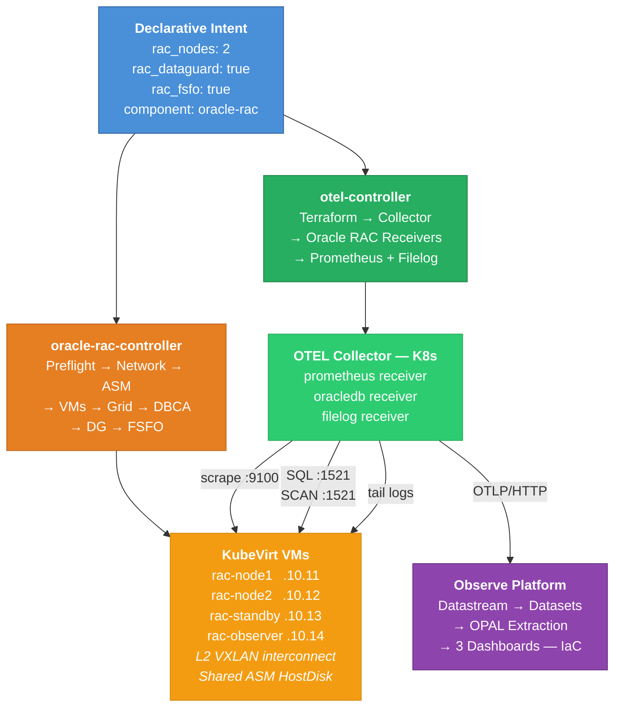
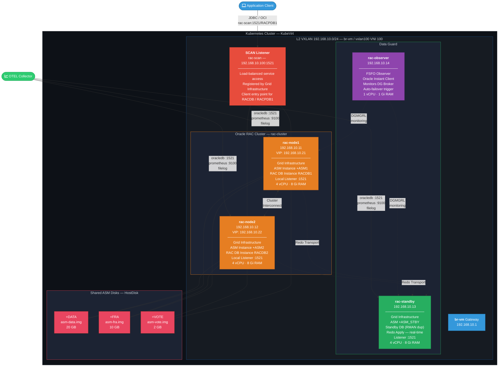
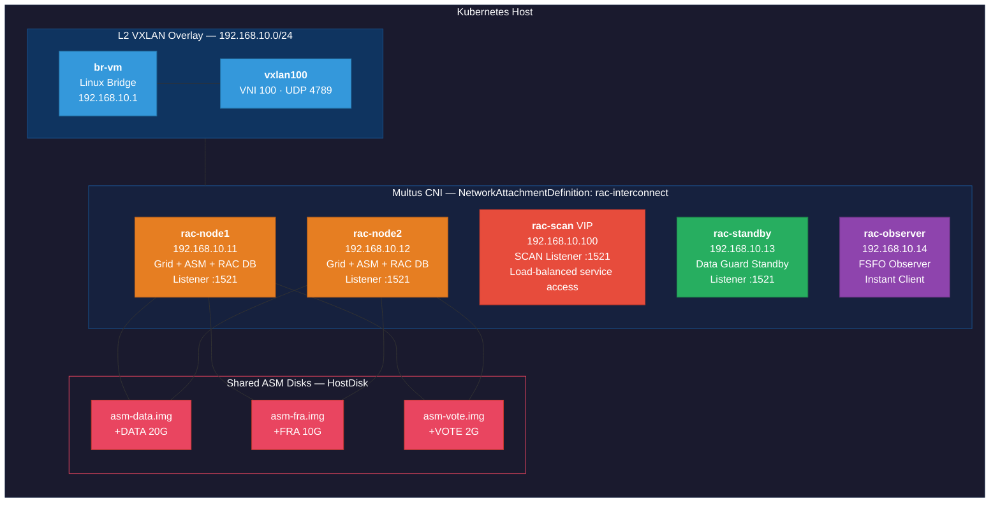
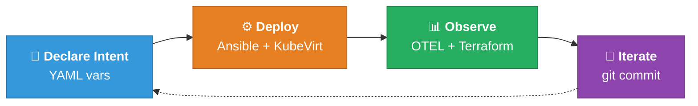

# Zero-Ops Oracle RAC: Fully Declarative Database Infrastructure with Closed-Loop Observability

*How a single Ansible command provisions a production-grade Oracle RAC cluster on Kubernetes, wires Prometheus and OpenTelemetry, and deploys Observe dashboards — all as code, with no manual intervention.*

---

## The Problem with Oracle RAC in the Cloud-Native Era

Oracle Real Application Clusters remains one of the most complex pieces of enterprise infrastructure to deploy. A production-grade RAC setup demands shared storage, private interconnect networking, Grid Infrastructure with ASM, multi-node cluster coordination, and — in high-availability configurations — Data Guard replication and Fast-Start Failover observers. That's before monitoring enters the picture.

Traditional approaches require weeks of manual work: provisioning VMs, configuring kernel parameters, creating ASM disk groups, running silent installers, establishing SSH equivalence, setting up Data Guard Broker, and then bolting on monitoring after the fact. Each step introduces drift, undocumented configuration, and operational risk.

This project takes a different approach. The entire Oracle RAC lifecycle — from VM creation through Grid Infrastructure, RAC database, Data Guard, observability pipeline, and cloud dashboards — is expressed as declarative code. Two controller playbooks. One `ansible-playbook` invocation. Zero manual steps.

**Source:** [oracle-rac](https://github.com/mazsola2k/platform-engineering/tree/main/oracle-rac) | [otel](https://github.com/mazsola2k/platform-engineering/tree/main/otel) | [observe-terraform](https://github.com/mazsola2k/platform-engineering/tree/main/otel/observe-terraform)

---

## Architecture at a Glance

The system has two declarative control planes that compose into a single automated workflow:



The key insight: **the observability pipeline is not bolted on after deployment — it is part of the same declarative workflow.** Terraform creates the Observe datastream and returns ingest credentials, which Ansible injects into the OTEL Collector configuration. The database, the telemetry agent, and the dashboards are all deployed atomically.

---

## Part 1: Declarative Oracle RAC on KubeVirt

### One Command, Six Topologies

The following diagram shows Topology C — the most complete variant — with all IP-addressable components:



The `oracle-rac-controller.yaml` playbook accepts a handful of declarative parameters and resolves which of six topology variants to deploy:

| Topology | `rac_nodes` | `rac_dataguard` | `rac_fsfo` | Result |
|----------|-------------|-----------------|------------|--------|
| **A** | 2 | false | false | 2-node RAC cluster |
| **B** | 2 | true | false | RAC + Data Guard standby (3 VMs) |
| **C** | 2 | true | true | RAC + DG + FSFO observer (4 VMs) |
| **D** | 0 | true | false | Primary + standby, no RAC (2 VMs) |
| **E** | 0 | true | true | Primary + standby + observer (3 VMs) |
| **F** | 0 | false | false | Single-node Oracle (1 VM) |

The operator expresses *intent*, not *procedure*:

```bash
ansible-playbook oracle-rac-controller.yaml \
  -e rac_action=install \
  -e rac_nodes=2 \
  -e rac_dataguard=true \
  -e rac_fsfo=true
```

This single invocation executes a nine-phase sequence:

### The Nine Phases

**Phase 1 — Preflight.** Validates that KubeVirt is operational with the `HostDisk` feature gate, the RHEL 9 qcow2 image exists, and the host has enough storage and memory for the requested topology.

**Phase 2 — L2 Network.** Creates a VXLAN overlay (VNI 100, UDP 4789) with a Linux bridge (`br-vm`) on the `192.168.10.0/24` subnet. Installs Multus CNI and creates a `NetworkAttachmentDefinition` so KubeVirt VMs receive static L2 IPs — a hard requirement for Oracle Cluster Interconnect and the SCAN listener.



The SCAN (Single Client Access Name) listener at `192.168.10.100:1521` provides load-balanced, location-transparent database access across the RAC nodes. It is registered automatically by Grid Infrastructure during Phase 5 and resolves to whichever RAC node can service the connection. The OTEL `oracledb` receiver connects through both the per-node listeners (:1521) and the SCAN listener for service-level monitoring.

**Phase 3 — Shared ASM Disks.** Creates raw disk images on the host filesystem: `asm-data.img` (20 GB), `asm-fra.img` (10 GB), `asm-vote.img` (2 GB). These are mounted as shared `HostDisk` volumes into each RAC node VM.

**Phase 4 — VM Provisioning.** For each node, the playbook creates a PersistentVolume with node affinity, converts the qcow2 image to raw format, injects cloud-init configuration (users, `/etc/hosts`, kernel parameters like `shmmax`/`shmall`/`sem`, security limits, RPM packages, Oracle/Grid groups), and creates the `VirtualMachine` CR with the Multus L2 interface attached.

**Phase 5 — Grid Infrastructure.** Establishes SSH key equivalence for the `grid` user across all nodes. Configures ASM device permissions with `udev` rules mapping disk serial numbers (`ASM_DATA`, `ASM_FRA`, `ASM_VOTE`) to persistent `/dev/oracleasm/` paths. Runs `gridSetup.sh` in silent mode, executes `root.sh` on each node, and applies the RHEL 9 ACFS module workaround.

**Phase 6 — RAC Database.** Runs DBCA in silent mode: container database with one PDB (`RACPDB1`), ASM storage on `+DATA` with recovery on `+FRA`, memory allocation at 40% of node RAM. Enables archivelog mode — a prerequisite for Data Guard.

**Phase 7 — Standby** (conditional). Provisions a separate VM with its own ASM disk images. Installs Grid Infrastructure on the standby node and creates the standby database via `RMAN DUPLICATE FROM ACTIVE DATABASE`.

**Phase 8 — Data Guard Broker** (conditional). Enables `DG_BROKER_START` on both primary and standby. Creates the DGMGRL configuration linking both databases. If FSFO is requested, issues `ENABLE FAST_START FAILOVER`.

**Phase 9 — Observer** (conditional). Deploys a lightweight VM running only Oracle Instant Client, configured as the FSFO observer process.

Every phase is idempotent. Every parameter has a sensible default. The entire playbook can also be driven by a Kubernetes Custom Resource:

```yaml
apiVersion: infra.example.com/v1
kind: OracleRAC
metadata:
  name: oracle-rac-production
spec:
  rac_action: install
  rac_nodes: 2
  rac_dataguard: true
  rac_fsfo: true
  rac_node_cpu: 4
  rac_node_memory: "8Gi"
  rac_db_name: RACDB
  rac_pdb_name: RACPDB1
```

### Built-in Diagnostics and Performance Testing

The same controller supports diagnostic and workload actions without any additional tooling:

- **`rac_action: status`** — Queries CRS resource status, database state, ASM disk groups, Data Guard configuration, and FSFO observer health across all nodes.
- **`rac_action: awr`** — Generates AWR, ADDM, ASH, SQL Monitor, SQL Tuning, and Health Monitor reports for a configurable time window.
- **`rac_action: perftest`** — Creates a synthetic OLTP schema and runs parallel worker sessions against the PDB for configurable duration and parallelism.

---

## Part 2: The Observability Pipeline — Prometheus, OpenTelemetry, Observe

Once the RAC cluster is running, a second controller deploys the full observability stack with the same declarative pattern:

```bash
ansible-playbook otel-controller.yaml \
  -e action=install \
  -e 'component=["observe-dashboards","collector","oracle-rac"]'
```

This triggers three coordinated stages.

### Stage 1: Terraform Creates the Observe Backend

The `observe-dashboards` component runs `terraform init` and `terraform apply` against the `observe-terraform/` module. This creates:

- **A datastream** named `oracle-rac-otel` — the OTEL ingest endpoint
- **A datastream token** — the bearer credential for the OTEL exporter
- **12 datasets** — 1 base extraction dataset, 8 filtered metric datasets, 4 log datasets
- **3 dashboards** — Overview, SQL Performance, Wait Events & I/O — with 30+ pre-built widgets

Terraform outputs the ingest endpoint (`https://<customer>.collect.observeinc.com/v1/otel`) and the bearer token. Ansible captures these as facts and injects them into the collector configuration — **the dashboard backend and the telemetry agent are wired together automatically**.

### Stage 2: OTEL Collector Deploys to Kubernetes

The `collector` component deploys the OpenTelemetry Collector (`otel/opentelemetry-collector-contrib:0.133.0`) as a Kubernetes Deployment with:

- A **ConfigMap** containing the merged YAML configuration from all enabled components
- A **Service** exposing ports 4317 (gRPC) and 4318 (HTTP)
- **Environment variables** for database credentials and the Observe ingest token, resolved from Vault or Ansible variables

### Stage 3: Oracle RAC Receivers Wire into the Collector

The `oracle-rac` component performs the heaviest setup. For each RAC node, it:

1. **SSHs into the VM** and installs `node_exporter` v1.8.2 as a systemd service on port 9100
2. **Deploys `oracle-rac-perf-collector.sh`** — a 634-line shell script that queries 14 Oracle performance views via sqlplus and writes Prometheus exposition format to the textfile collector directory
3. **Registers a cron job** running the script every 60 seconds
4. **Builds three receivers** per node in the OTEL Collector config:
   - `oracledb/rac-<node>` — native Oracle DB receiver via SQL on port 1521
   - `prometheus/rac-<node>` — scrapes `node_exporter` + custom textfile metrics on port 9100
   - `filelog/rac-<node>` — tails Oracle alert log, listener log, and audit trail

All receivers feed into a unified pipeline: `receivers → batch → otlphttp` exporter targeting the Observe ingest endpoint.

### What Gets Collected: 14 Metric Categories

The custom collector script extracts DBA-grade telemetry that goes far beyond what generic Oracle exporters provide:

| Category | Oracle Source | Why It Matters |
|----------|-------------|----------------|
| Instance health & uptime | `v$instance` | Is the database running? How long since last bounce? |
| System statistics | `v$sysstat` | AWR "Instance Activity" — physical reads, redo size, parse counts |
| Wait events & classes | `v$system_event` | AWR "Top Timed Events" — the gold standard for performance analysis |
| Top SQL by resource | `v$sqlarea` | Elapsed time, CPU, buffer gets, disk reads per SQL statement |
| SQL text mapping | `v$sqlarea` | Correlate `sql_id` to actual SQL text in dashboards |
| Active Session History | `v$active_session_history` | Real-time session sampling by wait class |
| Session breakdown | `v$session` | Active/inactive/background by session type |
| Lock analysis | `v$lock` | Enqueue lock counts with lock mode and request mode |
| Tablespace I/O | `v$filestat` | Read/write operations per tablespace |
| SGA/PGA memory | `v$sgastat`, `v$pgastat` | Memory allocation and utilization |
| Redo log activity | `v$log`, `v$log_history` | Log switches per hour — a key capacity indicator |
| Data Guard lag | `v$dataguard_stats` | Replication delay in seconds |
| Efficiency ratios | Computed | Buffer cache hit ratio, library cache hit ratio |
| Long-running SQL | `v$session`, `v$process` | Queries exceeding a threshold, process limit utilization |

Every metric is emitted with `instance`, `db_name`, and `host` labels auto-injected, enabling per-node drill-down across the entire RAC cluster.

### Log Shipping

Three log streams are tailed in real time via the OTEL `filelog` receiver:

| Log | Content | Use Case |
|-----|---------|----------|
| Alert log | ORA errors, instance startup/shutdown, parameter changes | Root cause analysis |
| Listener log | Connection attempts, TNS errors | Connectivity troubleshooting |
| Audit trail | SQL execution audit records | Security and compliance |

---

## Part 3: Observe — Dashboards as Code

The Terraform module in `observe-terraform/` doesn't just create a datastream and call it done. It builds a complete analytical layer using Observe's OPAL (Observe Processing and Analytics Language).

### The OPAL Extraction Pipeline

Raw OTEL payloads arrive as nested JSON in Observe. The base dataset applies a transformation that extracts 20+ structured columns:

```opal
make_col
  metric:string(FIELDS.name),
  value:float64(FIELDS.gauge.dataPoints[0].asDouble),
  instance:coalesce(
    string(EXTRA.attributes.instance),
    string(EXTRA.resource.attributes.instance),
    string(EXTRA.resource.attributes."service.instance.id")
  ),
  host:coalesce(
    string(EXTRA.attributes.host),
    string(EXTRA.resource.attributes.host),
    string(EXTRA.resource.attributes."host.name"),
    string(EXTRA.resource.attributes."net.host.name")
  ),
  session_type:string(EXTRA.attributes.type),
  wait_class:string(EXTRA.attributes.wait_class),
  sql_id:string(EXTRA.attributes.sql_id),
  sql_text:string(EXTRA.attributes.sql_text),
  ...
```

The multi-tier `coalesce` chains are essential. Prometheus metrics, OTEL-native metrics, and `oracledb` receiver metrics each place labels at different depths in the OTEL resource/attribute hierarchy. The extraction normalizes all sources into a single schema.

### Dataset Fan-Out

From the base dataset, eight metric datasets and four log datasets are derived by filtering on metric name prefixes:

```
Base → filter starts_with(metric, "oracle_instance_")  → Instance Health
Base → filter starts_with(metric, "oracle_sysstat")     → System Statistics
Base → filter starts_with(metric, "oracle_wait_")       → Wait Events
Base → filter starts_with(metric, "oracle_sql_")        → Top SQL
Base → filter starts_with(metric, "oracle_ash_")        → Active Sessions
Base → filter starts_with(metric, "oracle_tablespace_") → Storage I/O
Base → filter starts_with(metric, "oracle_dataguard_")  → Data Guard
```

This fan-out is defined as Terraform `for_each` resources — adding a new metric category means adding one entry to a map, not writing a new dataset resource.

### Three Dashboards, 30+ Widgets

Each dashboard is fully defined in Terraform — layout, OPAL queries, visualization types, and color schemes. Nothing is configured through the Observe UI.

**Oracle RAC Overview:**
Seven single-value cards (instance up, uptime, process count, long-running SQL, redo switches/hr, DG lag, blocked sessions), four bar charts (sessions by type, SGA by pool, tablespace usage %, ASH by wait class), and five timeseries (cache hit ratio, PGA stats, system statistics, wait class waits, top wait events).

**Oracle RAC SQL Performance:**
Seven timeseries charts each grouped by `sql_id` — elapsed time, CPU time, buffer gets, disk reads, executions, rows processed, average latency. Plus a SQL text reference table that maps every `sql_id` to its full SQL text.

**Oracle RAC Wait Events & I/O:**
Tablespace read/write operations, enqueue lock counts, wait class cumulative time, and average wait time by event — all as timeseries with instance-level granularity.

---

## The Closed Loop: Why This Matters

The traditional enterprise workflow looks like this:

1. A DBA manually provisions Oracle RAC over days or weeks
2. A monitoring team separately configures agents and dashboards
3. Configuration drifts. Dashboards break. Knowledge lives in people's heads
4. When it's time to rebuild, the process is partially documented at best

The declarative approach collapses this into a single, version-controlled, repeatable pipeline:



### What "Zero-Ops" Means in Practice

**No SSH.** VMs are provisioned with cloud-init. Configuration is injected declaratively — kernel parameters, user accounts, package lists, security limits, `/etc/hosts` entries. Nobody logs into a VM to run `gridSetup.sh` manually.

**No ClickOps.** Observe dashboards are Terraform resources. Changing a chart means editing a `.tf` file and running `terraform apply`. Dashboard definitions live in Git, not in someone's browser session.

**No credential passing.** The Ansible controller retrieves Oracle passwords from HashiCorp Vault, and the Terraform module creates Observe ingest tokens. These credentials are wired between components automatically — the Observe ingest token returned by Terraform is injected into the OTEL Collector configuration by Ansible in the same playbook run.

**No separate monitoring project.** The observability pipeline is a component of the deployment, not a follow-up project. When you provision a RAC cluster, you get dashboards. When you tear it down, dashboards are destroyed. The lifecycle is unified.

**Full idempotency.** Every playbook, every Terraform resource, every phase can be re-run safely. Partial failures are resumed, not restarted from scratch.

### The IaC Stack

| Layer | Tool | What It Manages |
|-------|------|----------------|
| VM lifecycle | Ansible + KubeVirt | VMs, PVs, cloud-init, networking |
| Oracle software | Ansible + silent installers | Grid, ASM, DBCA, DG Broker |
| Telemetry agents | Ansible + OTEL Collector | node_exporter, collector script, receivers |
| Analytics backend | Terraform + Observe | Datastreams, datasets, OPAL transforms, dashboards |
| Secrets | HashiCorp Vault | DB credentials, API tokens |
| Orchestration | Kubernetes CRD/CR | OracleRAC custom resource (operator pattern) |

---

## Reproducing This

### Full RAC + Observability Stack

```bash
# Step 1: Provision the RAC cluster (Topology C: 2 RAC + DG + FSFO)
ansible-playbook oracle-rac-controller.yaml \
  -e rac_action=install \
  -e rac_nodes=2 \
  -e rac_dataguard=true \
  -e rac_fsfo=true

# Step 2: Deploy observability (Observe dashboards + OTEL + RAC receivers)
ansible-playbook otel-controller.yaml \
  -e action=install \
  -e 'component=["observe-dashboards","collector","oracle-rac"]' \
  -e observe_customer=<CUSTOMER_ID> \
  -e observe_api_token=<API_TOKEN>
```

Two commands. A fully operational Oracle RAC cluster with Data Guard, FSFO, and production-grade observability in Observe — all from code.

### Tear Down Everything

```bash
ansible-playbook otel-controller.yaml \
  -e action=uninstall \
  -e 'component=["oracle-rac","collector","observe-dashboards"]'

ansible-playbook oracle-rac-controller.yaml \
  -e rac_action=uninstall
```

Clean teardown in reverse dependency order. VMs, storage, network, Kubernetes resources, Observe datasets, dashboards — all removed.

---

## Conclusion

Oracle RAC has earned its reputation as difficult infrastructure. But "difficult to operate" is not an inherent property of the technology — it's a property of the *process*. When that process is expressed as declarative code, the complexity lives in version-controlled playbooks and Terraform modules, not in runbooks and tribal knowledge.

This project proves that even the most complex enterprise database topology — multi-node RAC with shared ASM storage, VXLAN private interconnect, Data Guard replication, FSFO observer, 14-category performance telemetry, log shipping, and analytics dashboards — can be reduced to a handful of YAML variables and a `git push`.

The database runs. The metrics flow. The dashboards render. No one logged in.

---

*Project source: [platform-engineering](https://github.com/mazsola2k/platform-engineering) — [oracle-rac](https://github.com/mazsola2k/platform-engineering/tree/main/oracle-rac) · [otel](https://github.com/mazsola2k/platform-engineering/tree/main/otel) · [observe-terraform](https://github.com/mazsola2k/platform-engineering/tree/main/otel/observe-terraform)*