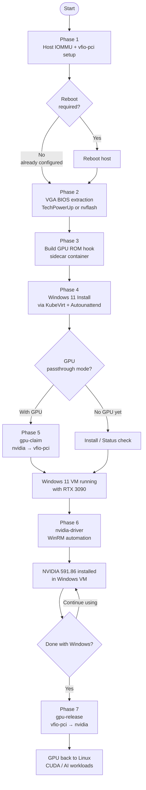
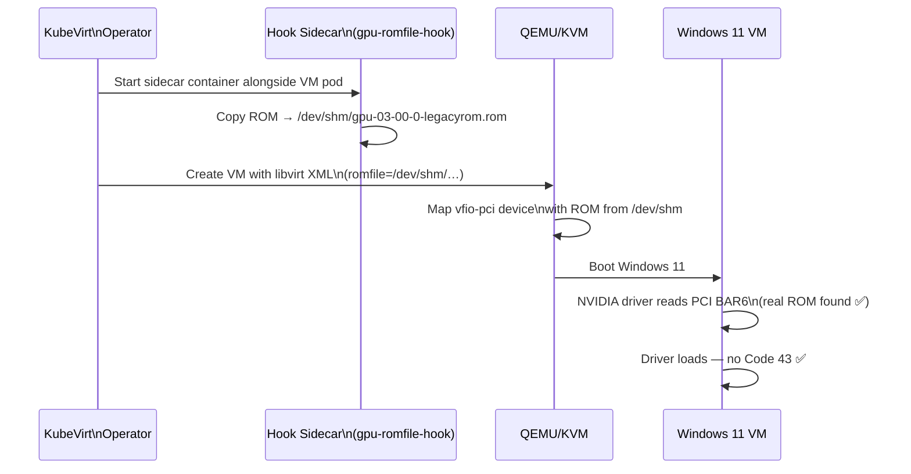
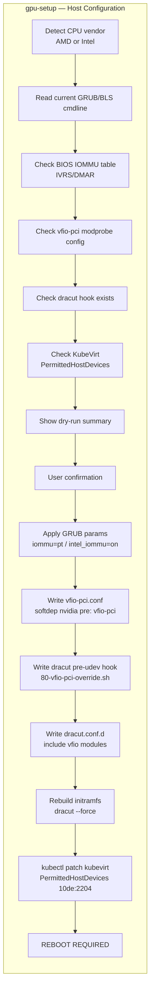
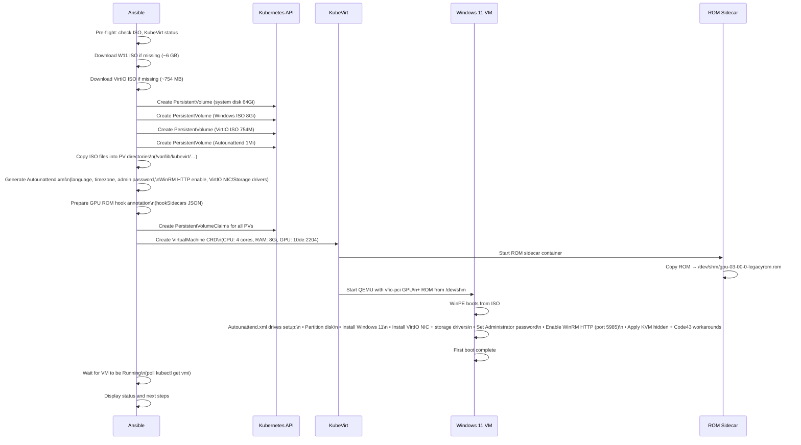
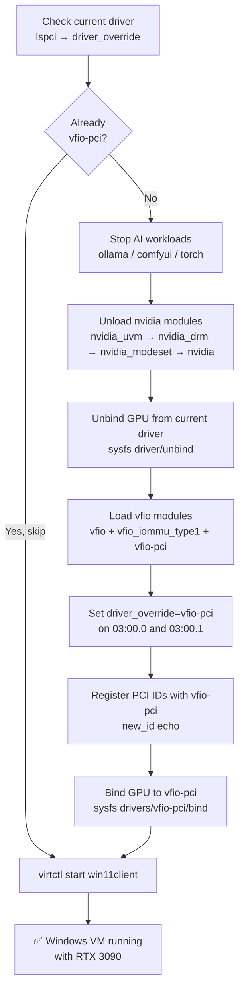
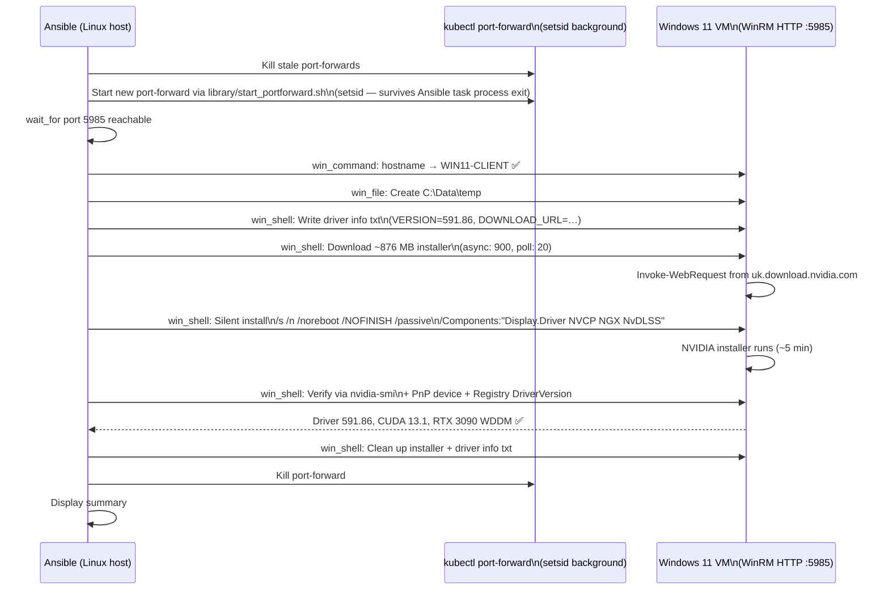
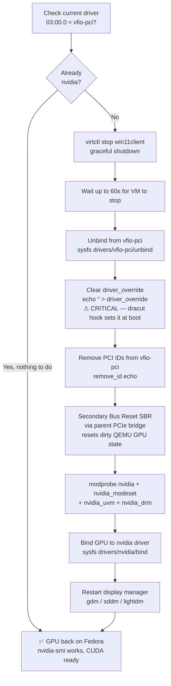

# Windows 11 Client — KubeVirt GPU Passthrough Documentation

End-to-end guide for running a Windows 11 VM under Kubernetes/KubeVirt with a dedicated NVIDIA GPU passed through via VFIO-PCI, including automated NVIDIA driver installation over WinRM.

---

## Table of Contents

1. [Architecture Overview](#architecture-overview)
2. [Prerequisites](#prerequisites)
3. [Full End-to-End Flow](#full-end-to-end-flow)
4. [Phase 0 — Concepts: IOMMU & PCIe Passthrough](#phase-0--concepts-iommu--pcie-passthrough)
5. [Phase 1 — Host Setup: IOMMU + vfio-pci](#phase-1--host-setup-iommu--vfio-pci)
6. [Phase 2 — VGA BIOS Extraction (TechPowerUp)](#phase-2--vga-bios-extraction-techpowerup)
7. [Phase 3 — Build the GPU ROM Hook Sidecar](#phase-3--build-the-gpu-rom-hook-sidecar)
8. [Phase 4 — Windows 11 Installation](#phase-4--windows-11-installation)
9. [Phase 5 — Claim GPU for Windows VM](#phase-5--claim-gpu-for-windows-vm)
10. [Phase 6 — NVIDIA Driver Installation (WinRM)](#phase-6--nvidia-driver-installation-winrm)
11. [Phase 7 — Release GPU Back to Linux](#phase-7--release-gpu-back-to-linux)
12. [Updating the NVIDIA Driver](#updating-the-nvidia-driver)
13. [Troubleshooting](#troubleshooting)
14. [File Reference](#file-reference)

---

## Architecture Overview

```
┌─────────────────────────────────────────────────────────────────┐
│  Kubernetes Node (Fedora Linux)                                  │
│                                                                  │
│  ┌──────────────────────┐   ┌──────────────────────────────┐   │
│  │  Fedora Host / CUDA  │   │  KubeVirt Windows 11 VM      │   │
│  │  (ollama, ComfyUI …) │   │  (WIN11-CLIENT)               │   │
│  │                      │   │                               │   │
│  │  GPU @ 0a:00.0       │   │  GPU @ 03:00.0  ←  vfio-pci │   │
│  │  driver: nvidia      │   │  driver: NVIDIA 591.86        │   │
│  └──────────────────────┘   └──────────────┬────────────────┘   │
│                                             │                    │
│  ┌──────────────────────────────────────────▼────────────────┐  │
│  │  KubeVirt Operator                                         │  │
│  │  • VirtualMachine CRD                                      │  │
│  │  • PermittedHostDevices (10de:2204)                        │  │
│  │  • GPU ROM Hook Sidecar (localhost/gpu-romfile-hook:latest) │  │
│  └────────────────────────────────────────────────────────────┘  │
│                                                                  │
│  PCIe Slot 03:00.0  →  IOMMU Group → vfio-pci driver           │
│  PCIe Slot 0a:00.0  →  nvidia driver (always on for Linux)      │
└─────────────────────────────────────────────────────────────────┘
```

**Key design decisions:**
- **Dual-GPU safe**: Only the RTX 3090 at `03:00.0` is passed to Windows. The second GPU at `0a:00.0` remains on `nvidia` for Linux AI workloads at all times.
- **No-reboot GPU switching**: `gpu-claim` and `gpu-release` dynamically rebind drivers at runtime using `driver_override` + `sysfs bind/unbind`.
- **VGA BIOS ROM injection**: A KubeVirt hook sidecar bakes the patched ROM into a container image and copies it to `/dev/shm` at VM startup — fixes the NVIDIA Code 43 error that occurs when the NVIDIA driver detects it is running inside a hypervisor.
- **WinRM automation**: Post-install tasks (driver install, configuration) run over WinRM HTTP on port 5985 via `kubectl port-forward`, managed by a persistent `setsid` background process.

---

## Prerequisites

| Requirement | Notes |
|-------------|-------|
| Kubernetes cluster | Single-node or multi-node, Fedora recommended |
| KubeVirt installed | `ansible-playbook k8s-redhat-kubevirt-controller.yaml -e action=install` |
| IOMMU enabled in BIOS | AMD: CBS → NBIO → IOMMU = Enabled. Intel: VT-d. |
| Two NVIDIA GPUs | One for Linux (AI/CUDA), one to pass through to Windows |
| virtctl installed | Required for VM start/stop/VNC access |
| ansible-collection `kubernetes.core` | `ansible-galaxy install -r requirements.yml` |
| `virtio-win.iso` | Downloaded automatically during install |
| Windows 11 ISO | Downloaded automatically during install |

---

## Full End-to-End Flow



---

## Phase 0 — Concepts: IOMMU & PCIe Passthrough

### What is IOMMU?

The **Input-Output Memory Management Unit** (IOMMU) is a hardware feature (AMD-Vi / Intel VT-d) that allows the OS to isolate PCIe devices into protected memory regions called **IOMMU groups**. When enabled:

- Each IOMMU group is an isolation boundary — devices within the same group must all be passed to the VM together, or none at all.
- The guest VM gets direct memory-mapped access to the device (DMA), so performance is near-native.
- The host OS cannot touch the device while the guest holds it.

### VFIO-PCI

`vfio-pci` is a Linux kernel driver that:
1. Takes ownership of a PCIe device away from its normal driver (e.g. `nvidia`).
2. Exposes it to userspace (QEMU/KVM) via `/dev/vfio/<group>`.
3. Enforces DMA isolation via the IOMMU so the VM cannot access other memory regions.

### The Code 43 Problem

When NVIDIA detects it is running inside a hypervisor (via CPUID), the Windows driver returns **Error Code 43** (device disabled). KubeVirt works around this with two mechanisms:

1. **KVM Hidden flag** — `kvm.hidden: true` in the VM spec hides the KVM CPUID signature, making the VM look like bare metal to NVIDIA.
2. **VGA BIOS ROM injection** — The NVIDIA driver reads the GPU firmware ROM from PCI BAR6. In passthrough, this read sometimes fails or returns corrupted data. Providing the real ROM via a hook sidecar ensures the driver finds valid firmware.

### KubeVirt Hook Sidecar

KubeVirt supports **hook sidecars**: small containers that run alongside a VM pod and can modify the VM's libvirt XML definition before the VM starts. The GPU ROM hook:

1. Copies the GPU ROM file to `/dev/shm/` (shared memory, visible to the QEMU process).
2. The main QEMU process reads `romfile=/dev/shm/gpu-03-00-0-legacyrom.rom` from the XML.
3. The ROM is injected into the VM's PCIe configuration space before the Windows driver initializes.



---

## Phase 1 — Host Setup: IOMMU + vfio-pci

This is a **one-time operation** per host. It modifies kernel boot parameters and initramfs, requiring a reboot.

```bash
# Dry-run — shows planned changes without applying:
ansible-playbook windows-client-controller.yaml -e action=gpu-setup

# Apply changes (interactive confirmation):
ansible-playbook windows-client-controller.yaml -e action=gpu-setup

# Skip confirmation prompt:
ansible-playbook windows-client-controller.yaml -e action=gpu-setup -e gpu_confirm=yes
```

### What the playbook does



### Slot-specific binding (dual-GPU safe)

The dracut pre-udev hook `/usr/lib/dracut/hooks/pre-udev/80-vfio-pci-override.sh` targets **only** `0000:03:00.0` and `0000:03:00.1`. It sets `driver_override=vfio-pci` on those slots before `udev` runs, so:

- GPU at `03:00.0` → bound to `vfio-pci` at boot (for Windows VM passthrough)
- GPU at `0a:00.0` → bound to `nvidia` at boot (stays for Linux/CUDA)

No `ids=` parameter is used in `modprobe.d` — this is intentional, since `ids=` would claim **all** matching GPUs.

### Verify after reboot

```bash
# Both IOMMU groups should exist and contain many devices:
ls /sys/kernel/iommu_groups/ | wc -l

# GPU at 03:00.0 should be vfio-pci:
lspci -k -s 0000:03:00.0    # Kernel driver in use: vfio-pci

# GPU at 0a:00.0 should still be nvidia:
lspci -k -s 0000:0a:00.0    # Kernel driver in use: nvidia

# AMD IOMMU active:
dmesg | grep AMD-Vi
```

---

## Phase 2 — VGA BIOS Extraction (TechPowerUp)

The GPU ROM file must be provided to the VM to prevent NVIDIA Code 43. You have two options:

### Option A — TechPowerUp VGA BIOS Collection (recommended, no GPU access needed)

TechPowerUp maintains the world's largest community-sourced GPU BIOS database at:

**https://www.techpowerup.com/vgabios/**

1. Go to https://www.techpowerup.com/vgabios/
2. Set **GPU** = `GeForce RTX 3090` (or your card model)
3. Filter by **Vendor**, **Memory**, and **Video BIOS Version** to match your card exactly
4. Download the `.rom` file
5. Verify the ROM matches your GPU:

```bash
# Check your GPU's BIOS version before downloading:
nvidia-smi --query-gpu=vbios_version --format=csv,noheader

# After download, verify the file is a valid PCI ROM:
file your-gpu.rom
# Expected: "xxxx: PCI ROM: ...NVIDIA Video BIOS..."

# Copy to the expected location:
sudo cp your-gpu.rom /var/lib/kubevirt/gpu-03-00-0-legacyrom.rom
sudo chown root:root /var/lib/kubevirt/gpu-03-00-0-legacyrom.rom
```

> **Tip:** Search TechPowerUp with your card's exact SubVendor ID and SubDevice ID from `lspci -v -s 03:00.0` to find the exact ROM for your board revision.

### Option B — Extract live from running GPU (requires GPU on nvidia driver)

```bash
# Only works when the GPU is currently bound to the nvidia driver:
sudo nvidia-smi --query-gpu=index --format=csv,noheader
# Then use nvflash or direct sysfs ROM read:
sudo cat /sys/bus/pci/devices/0000:03:00.0/rom > /var/lib/kubevirt/gpu-03-00-0-legacyrom.rom
```

### Option C — Extract via nvflash (Windows or Linux)

```powershell
# On Windows, from an elevated PowerShell:
# Download nvflash from https://www.techpowerup.com/download/nvidia-nvflash/
.\nvflash64.exe --save gpu_bios.rom
```

```bash
# On Linux:
sudo ./nvflash --save /var/lib/kubevirt/gpu-03-00-0-legacyrom.rom
```

> **Note:** The ROM file is named `gpu-03-00-0-legacyrom.rom` to reflect the PCI slot (`03:00.0`) and that a legacy (non-UEFI-only) ROM is required for QEMU BAR6 injection.

---

## Phase 3 — Build the GPU ROM Hook Sidecar

Once you have the ROM file at `/var/lib/kubevirt/gpu-03-00-0-legacyrom.rom`, build the hook sidecar container image:

```bash
source /opt/kubevirt-ansible-venv/bin/activate
ansible-playbook windows-client/hooks/build-hook-image.yaml
```

This playbook:
1. Copies the ROM into the `hooks/gpu-romfile-hook/` build context
2. Builds a container image with `podman`
3. Imports it into the `k8s.io` containerd namespace as `localhost/gpu-romfile-hook:latest`

The image contains the ROM and an entrypoint that copies it to `/dev/shm/` when the sidecar starts. It is referenced in the VM spec as a hook annotation with `imagePullPolicy: Never` (local image only).

```mermaid
flowchart LR
    ROM["/var/lib/kubevirt/\ngpu-03-00-0-legacyrom.rom"] --> |copy into build context| CTX["hooks/gpu-romfile-hook/\nDockerfile + rom"]
    CTX --> |podman build| IMG["localhost/gpu-romfile-hook:latest"]
    IMG --> |ctr import to k8s.io| CRI["containerd\nk8s.io namespace"]
    CRI --> |imagePullPolicy: Never| POD["VM Pod Sidecar"]
    POD --> |cp rom to /dev/shm| QEMU["QEMU receives\nromfile path"]
```



---

## Phase 4 — Windows 11 Installation

```bash
# With GPU passthrough (default — requires Phase 1-3 complete):
ansible-playbook windows-client-controller.yaml -e action=install

# Without GPU (for testing, or before host reboot):
ansible-playbook windows-client-controller.yaml -e action=install-nogpu
```

### What happens during install



### Key technical details of the VM spec

| Setting | Value | Why |
|---------|-------|-----|
| `kvm.hidden: true` | Yes | Hides KVM CPUID from NVIDIA driver → prevents Code 43 |
| `hyperv.relaxed/spinlocks/vapic` | Enabled | Performance optimisations for Windows guests |
| `firmware.bootloader.efi` | UEFI | Required for Windows 11 (secure boot optional) |
| `cpu.features` | `+topoext,+invtsc` | Better CPU topology visibility in guest |
| `devices.gpus[0]` | `10de:2204` (RTX 3090 VGA) | PCIe passthrough to VM |
| `devices.gpus[1]` | `10de:1aef` (RTX 3090 Audio) | Audio device also passed through |
| `hooks annotation` | `gpu-romfile-hook:latest` | Sidecar injects GPU ROM at VM start |
| Disk bus | `virtio-scsi` | Paravirtualised storage — requires VirtIO driver |
| NIC model | `virtio` | Paravirtualised NIC — requires VirtIO driver |

### Storage layout

```
/var/lib/kubevirt/
├── win11client-system-disk/disk.img      (64 GB — active Windows installation)
├── win11client-installer-iso/disk.img    (7.3 GB — Windows 11 ISO, safe to delete post-install)
├── win11client-virtio-iso/disk.img       (754 MB — VirtIO drivers, safe to delete post-install)
├── win11client-autounattend/disk.img     (382 KB — Autounattend XML, safe to delete post-install)
└── gpu-03-00-0-legacyrom.rom             (KEEP — GPU BIOS ROM used by hook sidecar)
```

---

## Phase 5 — Claim GPU for Windows VM

After the host has been rebooted (Phase 1 complete), claim the GPU at runtime without another reboot:

```bash
ansible-playbook windows-client-controller.yaml -e action=gpu-claim
```

### What happens during gpu-claim



---

## Phase 6 — NVIDIA Driver Installation (WinRM)

With Windows running and the GPU visible as a PCIe device, install the NVIDIA driver automatically over WinRM:

```bash
ansible-playbook windows-client-controller.yaml -e action=nvidia-driver
```

### What happens during nvidia-driver



### NVIDIA driver components installed

| Component | Switch | Purpose |
|-----------|--------|---------|
| `Display.Driver` | ✅ | Core GPU driver |
| `NVCP` | ✅ | NVIDIA Control Panel |
| `NGX` | ✅ | NVIDIA NGX (DLSS framework) |
| `NvDLSS` | ✅ | DLSS AI upscaling library |
| `GFE` / GeForce Experience | ❌ | Excluded — requires NVIDIA account sign-in |

### Updating the driver later

Edit two lines in `windows-client-controller.yaml`:

```yaml
vars:
  # NVIDIA Game Ready Driver — update these when a new driver is released
  nvidia_driver_version: "595.00"         # ← new version
  nvidia_driver_url: "https://uk.download.nvidia.com/Windows/595.00/595.00-desktop-win10-win11-64bit-international-dch-whql.exe"
```

Find the latest driver URL pattern:
1. Go to https://www.nvidia.com/en-gb/geforce/drivers/
2. Select: GeForce → RTX 3090 → Windows 11 64-bit → Game Ready Driver → Download
3. On the download confirmation page, right-click the download button → Copy link address
4. UK mirror pattern: `https://uk.download.nvidia.com/Windows/<VERSION>/<VERSION>-desktop-win10-win11-64bit-international-dch-whql.exe`

Then run:
```bash
ansible-playbook windows-client-controller.yaml -e action=nvidia-driver
```

---

## Phase 7 — Release GPU Back to Linux

When you are done with the Windows VM and want GPU resources back for Linux/CUDA workloads:

```bash
ansible-playbook windows-client-controller.yaml -e action=gpu-release
```

### What happens during gpu-release



> **Why SBR (Secondary Bus Reset)?** After QEMU releases a vfio-pci device, the NVIDIA GSP firmware did not shut down cleanly. The nvidia driver init fails with `kgspWaitForGfwBootOk_TU102: failed to wait for GFW boot complete`. The SBR triggered via the parent PCIe bridge performs a full hardware reset, clearing the dirty GPU state before the driver re-initialises.

---

## Complete Lifecycle Diagram

```mermaid
flowchart TD
    subgraph HS["Host Setup (one-time)"]
        direction TB
        BIOS["Enable IOMMU in BIOS\nAMD: CBS → NBIO → IOMMU\nIntel: VT-d"]
        GRUB["gpu-setup\nadd iommu=pt to BLS entries"]
        Dracut["gpu-setup\nvfio-pci hook + modprobe config"]
        KV1["gpu-setup\npatch KubeVirt PermittedHostDevices"]
        RBT(["Reboot host"])
        BIOS --> GRUB --> Dracut --> KV1 --> RBT
    end

    subgraph WI["Windows 11 Install"]
        direction TB
        PV["Create PersistentVolumes"]
        VM["Create VirtualMachine CRD"]
        WPE["WinPE + Autounattend.xml"]
        FB["Windows 11 installed\nWinRM HTTP enabled"]
        PV --> VM --> WPE --> FB
    end

    subgraph GC["GPU Claim"]
        direction TB
        SAI["Stop ollama / CUDA workloads"]
        UNV["rmmod nvidia*"]
        BVF["driver_override=vfio-pci\nbind to vfio-pci"]
        SVM(["virtctl start win11client"])
        SAI --> UNV --> BVF --> SVM
    end

    subgraph ND["NVIDIA Driver Install"]
        direction TB
        WRM["port-forward + wait_for 5985\nWinRM connected"]
        DL["win_shell download\n~876 MB installer"]
        SI["Silent install\n/s /n /noreboot /passive"]
        VFY["nvidia-smi + registry verify\nDriver 591.86 confirmed"]
        WRM --> DL --> SI --> VFY
    end

    subgraph GR["GPU Release"]
        direction TB
        SVM2["virtctl stop win11client"]
        UBV["Unbind vfio-pci\nclear driver_override"]
        SBR["Secondary Bus Reset\nparent PCIe bridge reset"]
        RBN["modprobe nvidia\nbind GPU to nvidia"]
        RDM["Restart display manager\ngdm / sddm"]
        SVM2 --> UBV --> SBR --> RBN --> RDM
    end

    START([Start]) --> HS
    HS --> VGAB["Extract GPU ROM\nTechPowerUp or nvflash"]
    VGAB --> SCB["build-hook-image.yaml\nbuild ROM sidecar container"]
    SCB --> WI
    WI --> GC
    GC --> ND
    ND --> WIN(["Windows 11 running\nRTX 3090 + Driver 591.86"])
    WIN --> GR
    GR --> LCUDA(["GPU back to Linux\nnvidia-smi / ollama / CUDA"])
    LCUDA -->|"Reclaim for Windows later"| GC
```



---

## Troubleshooting

### Code 43 — NVIDIA driver disabled in Device Manager

```
ProblemCode: 43 (0x2B)
```

Causes and fixes:

| Cause | Fix |
|-------|-----|
| KVM signature visible | Ensure `kvm.hidden: true` in VM spec |
| ROM file missing or corrupt | Re-extract from TechPowerUp, rebuild sidecar |
| Wrong ROM (different board revision) | Match VGA BIOS Version from `nvidia-smi --query-gpu=vbios_version` |
| Hook sidecar image not in k8s.io containerd namespace | Re-run `build-hook-image.yaml` |
| VM spec missing hooks annotation | Re-deploy VM with `action=reinstall` |

Verify ROM injection:
```bash
# Check sidecar is running alongside the VM pod:
kubectl get pods -l kubevirt.io/vm=win11client -o wide

# Check sidecar logs:
kubectl logs <pod-name> -c hook-sidecar-0
# Should show: "Copied GPU ROM to /dev/shm/gpu-03-00-0-legacyrom.rom"
```

### GPU not visible in Windows Device Manager

1. Confirm GPU is bound to `vfio-pci` on the host:
   ```bash
   lspci -k -s 03:00.0 | grep "Kernel driver in use"
   # Expected: vfio-pci
   ```
2. Confirm VM spec has GPU in `spec.template.spec.domain.devices.gpus`
3. Confirm `PermittedHostDevices` is patched in KubeVirt:
   ```bash
   kubectl get kubevirt kubevirt -n kubevirt -o jsonpath='{.spec.configuration.permittedHostDevices}'
   # Should include: {"pciVendorSelector":"10DE:2204","resourceName":"nvidia.com/RTX_3090"}
   ```

### WinRM connection refused

```
UNREACHABLE! => {"msg": "...Connection refused"}
```

Checks:
```bash
# Confirm port-forward is running:
ps aux | grep "kubectl.*port-forward.*5985"

# Manually test WinRM port:
curl -s http://localhost:5985/wsman

# Verify VM IP and WinRM service inside Windows via VNC:
virtctl vnc win11client

# Inside Windows (PowerShell):
winrm enumerate winrm/config/listener     # Should show HTTP listener on *
netsh advfirewall firewall show rule name="WinRM-HTTP"
```

### GPU stuck on vfio-pci after nvidia-smi fails (dirty GPU state)

```bash
# Manual SBR to clear dirty state:
GPU="0000:03:00.0"
PARENT=$(basename $(dirname $(readlink /sys/bus/pci/devices/$GPU)))
echo 1 > /sys/bus/pci/devices/$PARENT/reset
sleep 2
modprobe nvidia
echo "$GPU" > /sys/bus/pci/drivers/nvidia/bind
```

### IOMMU groups not showing up after reboot

- AMD: Verify BIOS setting: **Advanced → AMD CBS → NBIO Common Options → IOMMU → Enabled**
- Intel: Verify BIOS setting: **Advanced → CPU Configuration → Intel VT-d → Enabled**
- Check kernel parameter applied: `cat /proc/cmdline | grep iommu`

---

## File Reference

```
windows-client-controller.yaml         Main controller — entry point for all actions
windows-client/
├── README.md                           This file
├── windows11-install.yaml              Full Windows 11 install (with GPU passthrough)
├── windows11-install-nogpu.yaml        Install without GPU (testing/initial)
├── windows11-uninstall.yaml            Tear down VM + PVCs + PVs
├── windows11-status.yaml               Check VM status, IP, GPU, WinRM
├── windows11-gpu-setup.yaml            Phase 1: IOMMU setup + gpu-claim + gpu-release
├── windows11-automation.yaml          Phase 6: WinRM post-install (nvidia-driver, …)
└── hooks/
    ├── build-hook-image.yaml           Build the GPU ROM sidecar container
    └── gpu-romfile-hook/
        ├── Dockerfile
        └── gpu-03-00-0-legacyrom.rom   (generated by build — source from TechPowerUp)
```

### Quick command reference

```bash
# --- One-time host setup ---
ansible-playbook windows-client-controller.yaml -e action=gpu-setup
# → reboot host →

# --- Get GPU ROM from TechPowerUp, then: ---
ansible-playbook windows-client/hooks/build-hook-image.yaml

# --- Install Windows 11 ---
ansible-playbook windows-client-controller.yaml -e action=install

# --- Claim GPU + start VM ---
ansible-playbook windows-client-controller.yaml -e action=gpu-claim

# --- Install NVIDIA driver inside VM ---
ansible-playbook windows-client-controller.yaml -e action=nvidia-driver

# --- Check VM status ---
ansible-playbook windows-client-controller.yaml -e action=status

# --- Release GPU back to Linux ---
ansible-playbook windows-client-controller.yaml -e action=gpu-release

# --- Connect via VNC ---
virtctl vnc win11client

# --- Connect via RDP (via NodePort 32253) ---
# Find the node IP: kubectl get nodes -o wide
# Then RDP to: <node-ip>:32253
```
