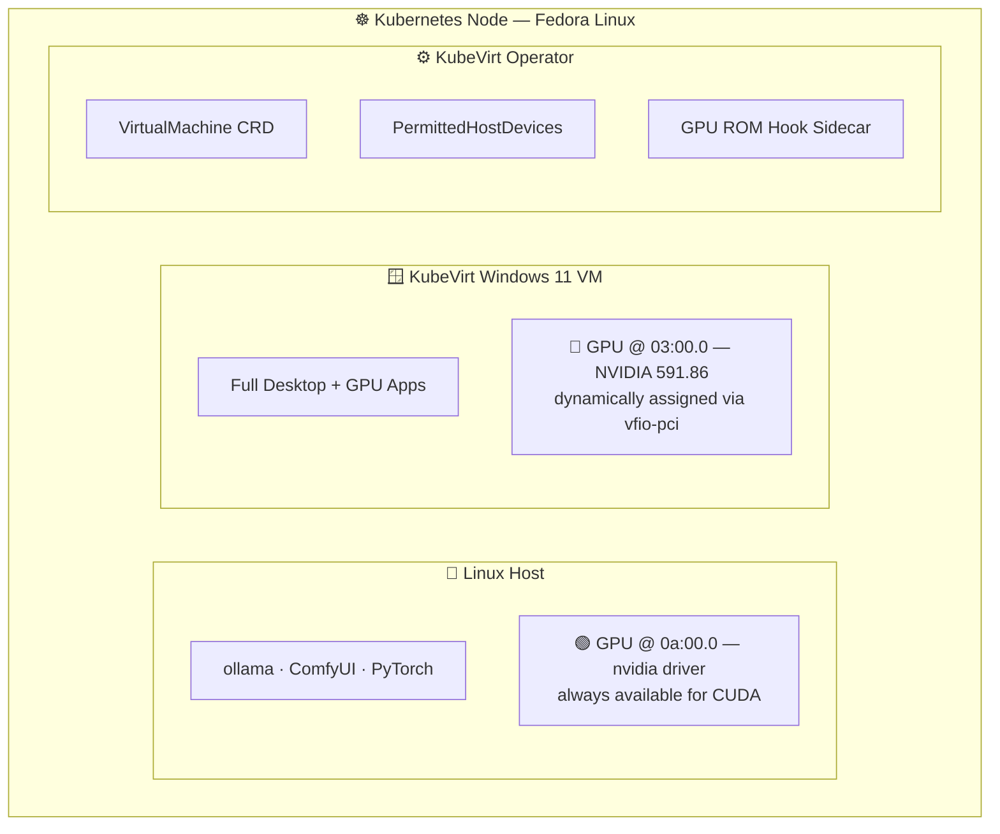
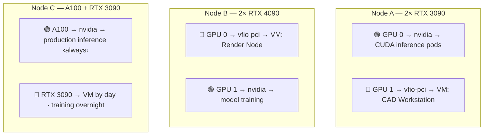
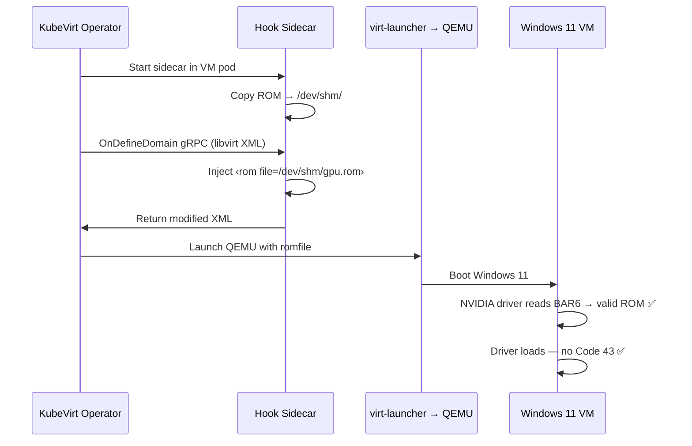
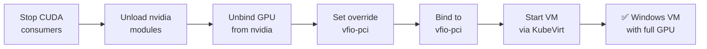
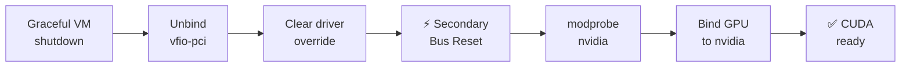
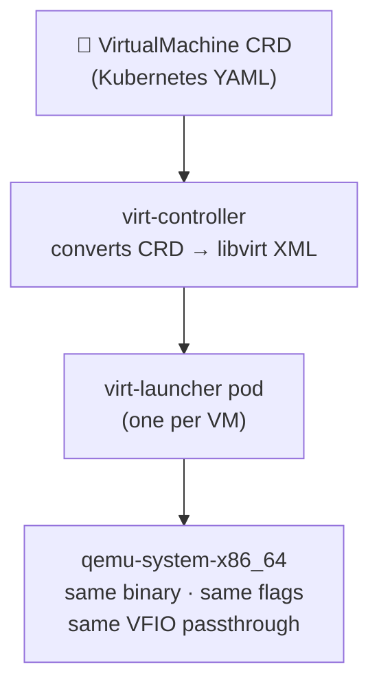

# Dynamic GPU Passthrough with KubeVirt

> **Stop Wasting Your Most Expensive Hardware**

---

## The Problem

A GPU costs more than most of the server it sits in. Yet in almost every environment, it spends most of its time doing nothing.

- An **ML team** trains models during business hours — the GPU is idle from 6 PM to 8 AM.
- An **engineer's VM** permanently holds a GPU for SolidWorks even while they're in meetings.
- A **developer** wants CUDA on Linux by day and a Windows desktop by night, but that means rebooting or buying a second machine.
- A **rendering farm** needs GPU compute overnight, but those same GPUs could serve inference during the day.

The GPU is always **statically assigned** — locked to one workload, one OS, one VM. The usual fixes all fall short:

| Approach | Downside |
|---|---|
| Buy more hardware | Expensive, still idle half the time |
| Permanently assign to VMs | Host loses access |
| Reboot to switch | Unacceptable downtime |
| vGPU / MIG | Licensing costs, fractional performance, specific GPU models only |

---

## The Solution

**Pass the full physical GPU between workloads at runtime.** No reboot. No virtualisation tax. No permanent assignment.

One command claims an NVIDIA GPU from the Linux host and hands it to a KubeVirt Windows 11 VM. Another command takes it back. The VM gets the **complete, unshared GPU** — every shader core, every byte of VRAM — with near-native performance. The switch takes seconds.

This works for any combination:

- Sharing GPUs across engineering desktops
- Running AI inference by day and batch rendering by night
- Priority-based GPU allocation across mixed workloads
- A single workstation that does Linux CUDA work and Windows gaming without rebooting

> Built and tested end-to-end on real hardware. The full implementation is open source.

---

## Architecture

The system runs on a Kubernetes node with two NVIDIA GPUs. Only one switches between host and VM — the other stays permanently available for Linux CUDA.

### Single Node



### Multi-Node Cluster

In a multi-node cluster, each GPU on each node is independently switchable. GPUs become **time-shared resources** allocated by demand, not static assignment:



---

## The Technical Foundation

### IOMMU and VFIO-PCI

The **IOMMU** (AMD-Vi / Intel VT-d) is a hardware feature that creates isolation boundaries around PCIe devices. When enabled, it grants a VM direct memory-mapped access to a GPU — the data path has no software translation layer. This is why passthrough delivers **near-native performance** rather than the overhead of GPU virtualisation.

**VFIO-PCI** is the kernel driver that makes this work from the software side. It doesn't drive hardware — it holds ownership of a PCIe device and exposes it to QEMU/KVM through `/dev/vfio/`. When a GPU is bound to `vfio-pci`, it disappears from the host completely. `nvidia-smi` won't see it. It exists solely as a passthrough device waiting for a VM.

### Slot-Specific Binding: The Dual-GPU Safety Mechanism

Most passthrough guides recommend `options vfio-pci ids=10de:2204` in `/etc/modprobe.d/`. This captures **every** GPU matching that vendor:device ID. If you have two identical RTX 3090s, both get claimed — the host loses all GPU access.

This implementation uses **slot-specific `driver_override`** instead. A dracut pre-udev hook runs during early boot and sets `driver_override=vfio-pci` on only the target PCI slots. The second GPU is never touched — it stays on `nvidia` permanently.

> This is what makes it safe to dynamically switch one GPU while the other continues serving CUDA workloads without interruption.

---

## Solving NVIDIA Code 43: The Hardest Problem in GPU Passthrough

This is the part that breaks most setups and the part most guides hand-wave through.

NVIDIA's Windows driver **actively detects virtualisation**. When CPUID returns KVM's hypervisor signature, the driver refuses to initialise — **Error Code 43** in Device Manager. Your GPU shows up, the driver installs, and then it just doesn't work.

Solving this requires two things working together:

### 1. Hide the Hypervisor

The VM spec sets `kvm.hidden: true`, removing the KVM signature from CPUID responses. Combined with a spoofed Hyper-V vendor ID, the VM appears to be bare metal from the driver's perspective.

### 2. Inject the VGA BIOS ROM

The NVIDIA driver reads firmware from PCI BAR6 during init. In passthrough, this read often fails — the host already consumed the ROM during its own boot. A known-good ROM copy must be provided to QEMU via the `romfile=` parameter.

### The Hook Sidecar Solution

Here's where KubeVirt's architecture forces a creative solution. There is **no CRD field** for `romfile=`. KubeVirt translates YAML to QEMU flags, but this particular flag has no YAML equivalent. The solution is a **hook sidecar** — a container that runs alongside the VM pod, intercepts the libvirt XML via a gRPC hook before QEMU starts, and injects the ROM path into the GPU's device definition.



The ROM is baked into the sidecar image at build time — no host-path mounts, no runtime dependencies. The VM spec references the sidecar via a pod annotation, and the injection happens automatically at every boot.

---

## The GPU Switching Lifecycle

The claim and release operations are the core of dynamic GPU switching. Each takes **seconds**, not minutes.

### Claiming a GPU — Host → VM



### Releasing a GPU — VM → Host



The Windows guest sees a **real NVIDIA RTX 3090** — full VRAM, full shader cores. `nvidia-smi`, DirectX, Vulkan, CUDA all work natively. After release, the host's CUDA stack is available immediately.

### Why Secondary Bus Reset Is Non-Negotiable

This is a problem you only discover after repeated claim/release cycles. After QEMU releases a GPU, the `nvidia` driver often can't reclaim it:

```
kgspWaitForGfwBootOk_TU102: failed to wait for GFW boot complete
```

The GPU's **GSP** (GPU System Processor) firmware didn't shut down cleanly. It's stuck in a partially torn-down state. The `nvidia` driver expects a clean power-on state and fails.

**The fix:** trigger a **Secondary Bus Reset** by writing to the parent PCIe bridge's reset sysfs file. This performs a full hardware reset of everything downstream — including the GSP firmware. After the reset, the GPU is clean and `nvidia` loads normally.

> Without SBR, you'd need a full host reboot after every VM shutdown — defeating the entire purpose of dynamic switching.

---

## KubeVirt IS QEMU

One insight that clarified the entire implementation: **KubeVirt does not replace QEMU. It orchestrates it.**



The operator reads a `VirtualMachine` CRD, converts it to libvirt XML, and passes it to `libvirtd`, which spawns `qemu-system-x86_64`. Every QEMU passthrough technique works identically. The CRD is just a different notation for the same command.

> Prototyped as a raw QEMU command line first, verifying every flag, before translating to KubeVirt YAML. The behaviour is identical. If you understand QEMU passthrough, you understand KubeVirt passthrough.

---

## What the Running VM Looks Like

The Windows 11 guest runs with:

| Layer | Implementation |
|---|---|
| **Firmware** | UEFI via OVMF |
| **Storage** | VirtIO paravirtualised (requires VirtIO drivers in guest) |
| **Networking** | VirtIO NIC |
| **GPU** | Full physical NVIDIA RTX 3090 via PCIe passthrough |
| **Performance tuning** | Hyper-V enlightenments: `relaxed`, `spinlocks`, `vapic`, `synic` |
| **Anti-detection** | `kvm.hidden` + spoofed vendor ID + ROM injection |
| **Driver install** | Automated over WinRM via `kubectl port-forward` tunnel |

Inside Windows, the GPU appears as a native device in Device Manager. There is **no visible difference** from a bare-metal installation. NVIDIA driver installation is fully automated — the playbook tunnels into the guest over WinRM, downloads the driver, runs a silent install, and verifies via `nvidia-smi`. No manual interaction at any point.

---

## The Bigger Picture

The core idea: **a GPU doesn't have to belong to one workload forever.**

| Component | Role |
|---|---|
| PCIe passthrough via VFIO | Complete physical GPU with near-native performance |
| Slot-specific `driver_override` | Safe multi-GPU systems |
| Sysfs bind/unbind | Switching in seconds |
| Secondary Bus Reset | Solves dirty firmware state without reboot |
| Hook sidecar pattern | ROM injection for Code 43 — the one thing KubeVirt can't express natively |
| KubeVirt | VM as a Kubernetes-native resource, schedulable like any pod |

**Stop letting your most expensive hardware sit idle. Make it move.**

---

## Resources

The full implementation — Ansible playbooks, KubeVirt manifests, hook sidecar, GPU claim/release automation — is open source at [github.com/mazsola2k/kubernetes-installer](https://github.com/mazsola2k/kubernetes-installer).

**Built and tested on:** Fedora Linux · Dual NVIDIA RTX 3090 GPUs · Kubernetes · KubeVirt
