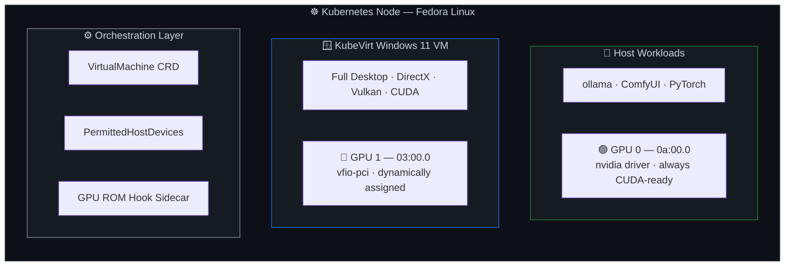
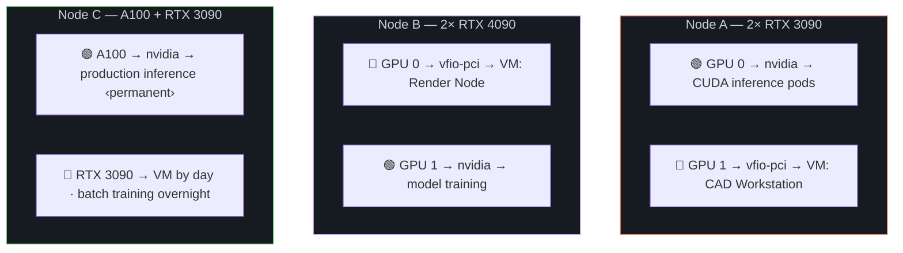
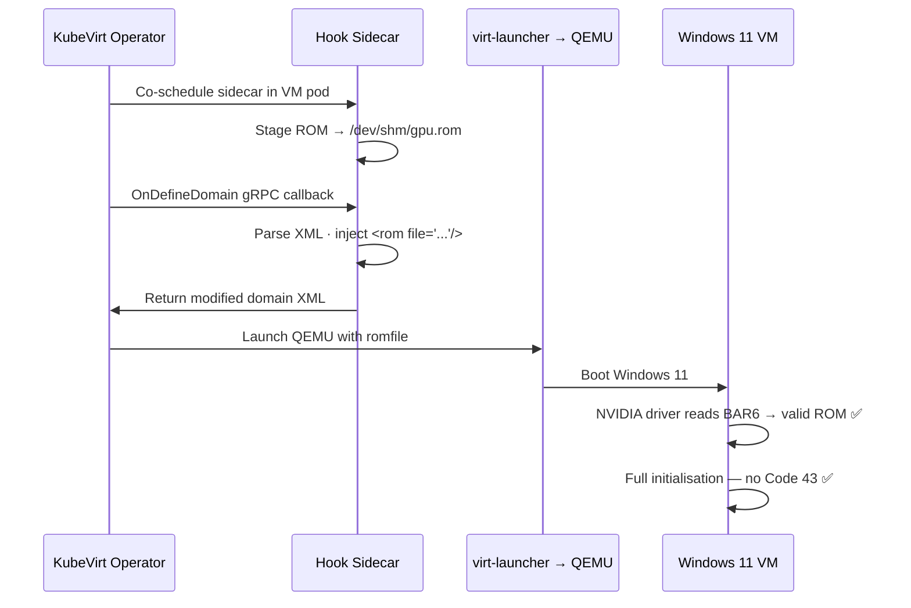
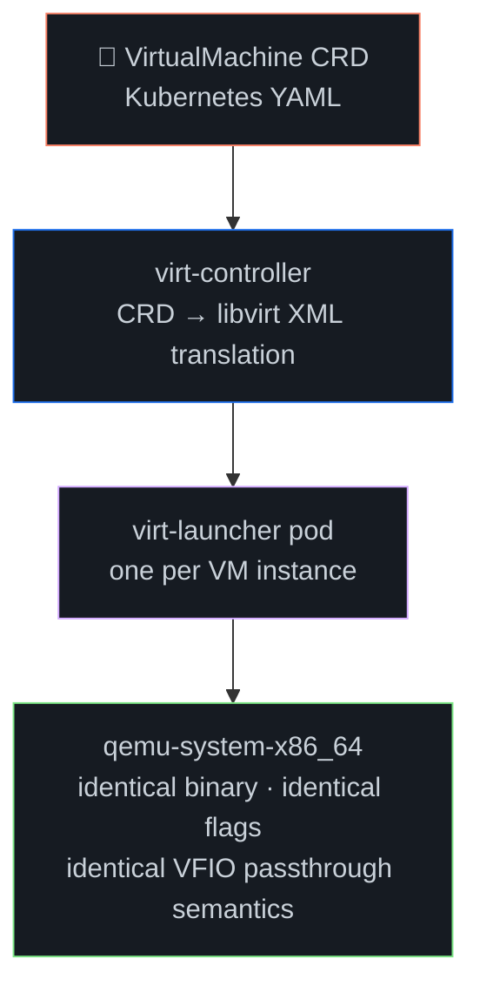

<div align="center">

# Dynamic GPU Passthrough with KubeVirt

### Deterministic, Zero-Downtime GPU Multiplexing at the Hardware Layer

[](https://kubernetes.io)
[](https://kubevirt.io)
[](https://nvidia.com)
[](https://fedoraproject.org)
[](LICENSE)

*Full PCIe device reassignment between host and guest operating systems in under 10 seconds — no reboot, no virtualisation overhead, no fractional sharing.*


</div>

---

## Abstract

Modern GPU-accelerated workloads — large language model inference, real-time rendering, CAD simulation, scientific computing — demand the full, unpartitioned resources of a discrete GPU. Yet the dominant deployment model **statically binds** each GPU to a single workload for its entire uptime window, yielding utilisation rates as low as 15–30% across a 24-hour cycle.

This project implements **runtime GPU reassignment** between a Linux host and KubeVirt-managed Windows 11 virtual machines using IOMMU-mediated PCIe passthrough. The mechanism provides:

- **Full device isolation** — the VM receives every shader core, every byte of VRAM, every PCIe lane
- **Near-native performance** — no hypervisor translation layer in the GPU data path
- **Sub-10-second switching** — deterministic bind/unbind via kernel sysfs interfaces
- **Multi-GPU safety** — slot-specific driver override protects co-resident GPUs

> Built, tested, and validated end-to-end on production hardware. Fully open source.

---

## The Problem

GPUs are the most expensive, most power-hungry components in a modern server — and in most environments, they sit idle the majority of the time. An ML team trains during business hours; the GPU does nothing overnight. An engineer's VM holds a GPU for CAD even while they're in meetings. A developer wants CUDA on Linux and a Windows desktop, but can't have both without rebooting or buying a second machine.

The GPU is always **statically assigned** — locked to one workload, one OS, one VM. The usual fixes all fall short:

- **Buy more hardware** — expensive, and the new GPU is idle just as often
- **Permanently assign to VMs** — the host loses GPU access entirely
- **Reboot to switch** — minutes of downtime per transition
- **vGPU / MIG** — fractional performance, limited to specific GPU models

### Why Not SR-IOV?

The enterprise approach to GPU sharing is **SR-IOV** (Single Root I/O Virtualisation) — a PCIe specification that allows a single physical device to present multiple Virtual Functions (VFs), each assignable to a different VM simultaneously. NVIDIA supports this on **datacenter-class GPUs only**: the A-series (A100, A30, A16), Quadro RTX enterprise cards, and the newer H100 / L40S. These GPUs expose a hardware-level partitioning capability that the hypervisor can allocate without full device passthrough.

Consumer GeForce RTX cards — the 3090, 4090, and their siblings — **do not implement SR-IOV**. The firmware simply does not expose Virtual Functions. No driver or software configuration can change this; it is a hardware and firmware boundary.

This project takes the alternative path: **full PCIe passthrough of a consumer RTX GPU** via VFIO. Instead of slicing one GPU into fractions shared across VMs concurrently, the entire physical device is reassigned between workloads **sequentially** — one consumer at a time, but switchable in seconds. The trade-off is explicit:

| | SR-IOV (A-series / Quadro) | VFIO Passthrough (GeForce RTX) |
|:--|:--|:--|
| **Concurrent VMs per GPU** | Multiple (hardware-partitioned VFs) | One (exclusive device ownership) |
| **Per-VM performance** | Fractional (VRAM and compute divided) | Full (every core, every byte of VRAM) |
| **GPU hardware required** | Enterprise datacenter SKUs | Any discrete GPU with IOMMU support |
| **Switching model** | Static partition at VM creation | Dynamic reassignment at runtime |
| **Cost** | Enterprise GPU pricing | Consumer GPU pricing |

For workloads that need the **complete, unpartitioned GPU** — gaming, full-resolution CAD, large model inference, single-VM rendering — passthrough on a consumer RTX card delivers what SR-IOV cannot: the entire device at native performance, at a fraction of the hardware cost.

**The alternative:** treat the GPU as a **time-multiplexed resource** that moves between consumers on demand.

---

## Solution Architecture

The system operates on a Kubernetes node equipped with two NVIDIA GPUs. One GPU is dynamically reassignable; the other remains permanently bound to the host's `nvidia` driver for uninterrupted CUDA workloads.

### Single-Node Topology



### Multi-Node Scaling

In a multi-node cluster, each GPU on each node is independently switchable. GPUs become **time-shared infrastructure** — allocated by demand, not by static assignment:



---

## Technical Foundations

### IOMMU: Hardware-Enforced Device Isolation

The **Input–Output Memory Management Unit** (AMD-Vi / Intel VT-d) is a chipset-level component that interposes on all DMA transactions between PCIe endpoints and system memory. When configured in passthrough mode (`iommu=pt`), it establishes per-device address translation tables that map a VM's guest-physical addresses directly to host-physical pages — creating an isolated, hardware-enforced memory domain for the assigned device.

The critical consequence: **the GPU's entire DMA path bypasses the hypervisor**. Shader dispatches, VRAM transfers, and PCIe BAR accesses reach physical memory without software interposition. This is the mechanism that delivers near-native performance — not approximation, but the absence of a translation layer entirely.

### VFIO-PCI: Kernel-Level Device Ownership

**VFIO** (Virtual Function I/O) is the Linux kernel subsystem that manages device assignment to userspace processes — in this case, QEMU. When a GPU is bound to the `vfio-pci` driver:

1. The device is removed from host visibility (`nvidia-smi` reports nothing)
2. Its MMIO regions and interrupts are exposed through `/dev/vfio/<group>`
3. QEMU maps these regions directly into the VM's address space

The GPU ceases to exist as a host resource and becomes exclusively available to the virtual machine.

### Slot-Specific Binding: Multi-GPU Safety

Conventional passthrough configurations use vendor:device ID matching (`options vfio-pci ids=10de:2204`), which captures **every** device with that ID. In a dual-GPU system with identical cards, this is catastrophic — both GPUs are claimed, and the host loses all graphics and CUDA capability.

This implementation uses **per-slot `driver_override`** — a dracut pre-udev hook that targets specific PCI bus addresses:

```bash
# Only GPU at 03:00.0 is claimed — GPU at 0a:00.0 is never touched
for DEV in 0000:03:00.0 0000:03:00.1; do
    echo "vfio-pci" > /sys/bus/pci/devices/${DEV}/driver_override
done
```

The second GPU remains permanently on the `nvidia` driver, serving CUDA workloads without interruption — before, during, and after VM operations.

---

## Resolving NVIDIA Code 43 in Passthrough

<div align="center">

*The single most common failure mode in GPU passthrough — and the least well-documented resolution.*

</div>

NVIDIA's Windows driver checks the execution environment during initialisation. When the `CPUID` instruction returns a hypervisor signature leaf (`0x40000000`), the driver reports **Error Code 43** in Device Manager. The GPU is enumerated and the driver binary loads, but initialisation does not complete. This is expected behaviour — the GeForce driver is designed and validated for bare-metal and supported virtualisation platforms.

In a VFIO passthrough configuration, the VM has **exclusive, unshared access** to the physical GPU — the same hardware isolation as bare metal. The driver's environment check does not distinguish this case from shared/emulated GPU virtualisation. Two configuration adjustments align the VM's reported environment with its actual hardware-exclusive state:

### 1 · Presenting the Correct Execution Environment

The VM specification sets `kvm.hidden: true`, which adjusts the CPUID responses to reflect the VM's dedicated hardware access model. A compatible Hyper-V vendor ID is also configured. These settings ensure the driver's environment validation matches the actual passthrough topology — where the GPU is not shared or emulated.

### 2 · VGA BIOS ROM Provisioning

The NVIDIA driver reads firmware from **PCI BAR6** (the expansion ROM base address register) during early init. In passthrough configurations, this read frequently fails — the host GPU driver already consumed the ROM during its own POST sequence. Providing the correct ROM image via QEMU's `romfile=` parameter ensures the driver finds valid firmware at the expected address.

### 3 · The Hook Sidecar Pattern

KubeVirt's CRD schema has **no native field** for QEMU's `romfile=` parameter. The translation from `VirtualMachine` YAML to libvirt XML simply does not include this path.

The solution: a **gRPC hook sidecar** — a container co-scheduled in the VM pod that intercepts the `OnDefineDomain` lifecycle event, modifies the libvirt XML in-flight, and injects the ROM path before QEMU launches:



The ROM is embedded in the sidecar container image at build time. No host-path mounts. No runtime file dependencies. The injection is fully autonomous on every VM boot.

---

## GPU Switching Lifecycle

The claim and release operations constitute the core runtime interface. Each completes in **under 10 seconds**.

### Claim: Host → VM


### Release: VM → Host


The Windows guest receives a **real NVIDIA RTX 3090** — full VRAM, full shader cores, full PCIe bandwidth. `nvidia-smi`, DirectX 12, Vulkan 1.3, and CUDA all operate natively. After release, the host's CUDA stack resumes immediately.

---

## KubeVirt as QEMU Orchestration

A key architectural insight: **KubeVirt does not replace QEMU — it orchestrates it.**



The operator reads a `VirtualMachine` CRD, converts it to libvirt XML, and delegates to `libvirtd`, which spawns `qemu-system-x86_64`. Every QEMU passthrough technique — VFIO device assignment, ROM injection, CPUID masking — functions identically whether invoked via KubeVirt YAML or a raw command line.

> This implementation was prototyped as a raw QEMU command line first ([`windows11-kvm-test.yaml`](windows-client/windows11-kvm-test.yaml)), validating every flag, before translation to KubeVirt manifests. The runtime behaviour is identical.

### QEMU → KubeVirt Parameter Translation

Every QEMU flag has a KubeVirt CRD equivalent — except one. The translation was mapped by building a working raw QEMU command first, then expressing each flag as structured YAML. The critical parameters, and the ones most likely to cause silent failures if omitted:

| QEMU / libvirt flag | KubeVirt CRD field | Why it matters |
|:--|:--|:--|
| `-machine q35,accel=kvm` | `domain.machine.type: q35` | Q35 chipset with PCIe topology; KVM acceleration is implicit |
| **`kernel-irqchip=on`** | **`features.ioapic.driver: kvm`** | **Routes hardware interrupts through the in-kernel IOAPIC. Without this, PCIe passthrough devices receive no IRQs and the GPU appears dead to the guest** |
| `-cpu host` | `cpu.model: host-passthrough` | Exposes all host CPU features — required for NVIDIA driver compatibility checks |
| `+topoext,+invtsc` | `cpu.features[]: [topoext, invtsc]` | NUMA topology visibility + invariant TSC for stable guest timekeeping |
| `kvm=off` | `features.kvm.hidden: true` | Strips KVM hypervisor signature from CPUID — prevents NVIDIA Code 43 |
| `hv_vendor_id=...` | `features.hyperv.vendorid: ...` | Compatible Hyper-V vendor ID for correct environment reporting |
| `hv_relaxed` | `features.hyperv.relaxed: {}` | Relaxed timer enforcement — reduces Windows BSOD risk under load |
| `hv_spinlocks=0x1000` | `features.hyperv.spinlocks.retries: 8191` | Guest spinlock retry count before yielding to hypervisor |
| `hv_vapic` | `features.hyperv.vapic: {}` | Virtual APIC acceleration — faster interrupt delivery |
| `hv_time,hv_runtime,hv_synic,hv_reset,hv_vpindex,hv_tlbflush,hv_ipi` | `features.hyperv.{freqs,runtime,synic,reset,vpindex,tlbflush,ipi}: {}` | Hyper-V enlightenments — Windows detects these and enables optimised kernel code paths |
| `-drive if=pflash,...OVMF_CODE.fd` | `firmware.bootloader.efi.secureBoot: false` | UEFI via OVMF; KubeVirt manages NVRAM persistence automatically |
| `-device virtio-blk-pci,...` | `devices.disks[].disk.bus: virtio` | Paravirtualised block I/O — requires VirtIO drivers in guest |
| `-device virtio-net-pci,...` | `devices.interfaces[].model: virtio` | Paravirtualised NIC — requires VirtIO drivers in guest |
| `-device usb-tablet` | `devices.inputs[].type: tablet, bus: usb` | Absolute pointer — prevents mouse capture in VNC/console |
| `-device vfio-pci,host=03:00.0` | `devices.gpus[].deviceName: nvidia.com/RTX_3090` | GPU passthrough; KubeVirt resolves PCI address via the device plugin |
| `-device vfio-pci,host=03:00.1` | second entry in `devices.gpus[]` | GPU HDMI audio — same IOMMU group, must be passed together |
| **`romfile=/path/to/gpu.rom`** | **No CRD field — solved via hook sidecar** | **The one parameter KubeVirt cannot express natively** |

### The IRQ Routing Problem

The `kernel-irqchip=on` → `features.ioapic.driver: kvm` mapping deserves special attention. In a standard VM without passthrough devices, the default virtual IOAPIC works fine. But when a physical PCIe device is passed through via VFIO, its **MSI/MSI-X interrupts must be routed through the kernel's IRQ chip**, not the userspace-emulated one.

If this is set incorrectly (or left at the default), the passthrough GPU receives no interrupts. The device appears enumerated in Device Manager but the driver initialisation hangs or fails silently — a failure mode that looks identical to a Code 43 but has an entirely different root cause. The QEMU flag `kernel-irqchip=on` and the KubeVirt field `features.ioapic.driver: kvm` are the same instruction expressed in two notations: **route all I/O APIC interrupts through KVM's in-kernel implementation**.

### ROM Injection: The One Parameter KubeVirt Cannot Express

The `romfile=` QEMU flag — which supplies the VGA BIOS ROM to the passthrough device — has **no equivalent CRD field**. KubeVirt's translation layer simply does not include it. This is the single parameter that required a workaround outside the standard CRD schema.

The solution is the **hook sidecar** pattern described in [Resolving NVIDIA Code 43 in Passthrough](#resolving-nvidia-code-43-in-passthrough). In a raw QEMU prototype, the flag is trivial:

```bash
-device vfio-pci,host=03:00.0,multifunction=on,romfile=/path/to/gpu.rom
```

In KubeVirt, the sidecar intercepts the libvirt XML via a gRPC `OnDefineDomain` hook, injects `<rom file='/dev/shm/gpu-03-00-0-legacyrom.rom'/>` into the GPU's `<hostdev>` element, and returns the modified XML. QEMU then sees the `romfile=` parameter transparently — as if it had been there from the start.

```
  VM Pod
  ┌─────────────────────────────────────────────────────────┐
  │  ┌──────────────────────────┐     /dev/shm/             │
  │  │  gpu-romfile-hook        │──→  gpu-03-00-0-          │
  │  │  (sidecar container)     │     legacyrom.rom         │
  │  │                          │          │                │
  │  │  OnDefineDomain gRPC:    │          │                │
  │  │  inject <rom file=.../>  │          │                │
  │  └──────────────────────────┘          │                │
  │                                        ↓                │
  │  ┌──────────────────────────────────────────────────┐   │
  │  │  virt-launcher → libvirt → qemu-system-x86_64    │   │
  │  │  -device vfio-pci,host=03:00.0,romfile=          │   │
  │  │              /dev/shm/gpu-03-00-0-legacyrom.rom   │   │
  │  └──────────────────────────────────────────────────┘   │
  └─────────────────────────────────────────────────────────┘
```

All containers in a pod share the same IPC namespace — `/dev/shm` written by the sidecar is visible to `virt-launcher` and QEMU. The ROM is baked into the sidecar image at build time. No host-path mounts, no runtime dependencies.

---

## Guest VM Specification

The Windows 11 virtual machine is configured for maximum performance and driver compatibility:

| Layer | Implementation | Rationale |
|:--|:--|:--|
| **Firmware** | UEFI via OVMF | Windows 11 requires Secure Boot–capable firmware |
| **Storage** | VirtIO SCSI (paravirtualised) | Near-native I/O; requires VirtIO guest drivers |
| **Network** | VirtIO NIC | Low-latency, high-throughput paravirtualised networking |
| **GPU** | NVIDIA RTX 3090 via PCIe passthrough | Full device — unshared, unpartitioned |
| **CPU Features** | Hyper-V enlightenments | `relaxed`, `spinlocks`, `vapic`, `synic`, `frequencies` |
| **Environment Config** | `kvm.hidden` + Hyper-V vendor ID + ROM | Correct CPUID and firmware for passthrough topology |
| **Automation** | WinRM via `kubectl port-forward` | Fully unattended driver install and verification |

Inside Windows, the GPU appears as a **native device** in Device Manager. There is no observable difference from a bare-metal installation. NVIDIA driver deployment is fully automated — the Ansible playbook establishes a WinRM tunnel through `kubectl port-forward`, downloads the driver, executes a silent install, and validates via `nvidia-smi`. Zero manual interaction.

---

## System Components

| Component | Function |
|:--|:--|
| **IOMMU + VFIO-PCI** | Hardware-isolated PCIe passthrough with DMA remapping |
| **Slot-specific `driver_override`** | Per-GPU binding safety in multi-GPU topologies |
| **Sysfs bind/unbind** | Kernel interface for sub-second driver switching |
| **Secondary Bus Reset** | PCIe bridge-level hardware reset for clean state recovery |
| **gRPC hook sidecar** | Runtime libvirt XML modification for ROM injection |
| **KubeVirt** | VM lifecycle as a Kubernetes-native schedulable resource |

<div align="center">

### The GPU is infrastructure. Make it move.

</div>

---

## Repository

The complete implementation — Ansible playbooks, KubeVirt manifests, hook sidecar container, GPU claim/release automation — is open source:

<div align="center">

**[github.com/mazsola2k/kubernetes-installer](https://github.com/mazsola2k/kubernetes-installer)**

</div>

### Validated Environment

| Component | Version |
|:--|:--|
| **OS** | Fedora Linux (latest stable) |
| **GPUs** | 2× NVIDIA GeForce RTX 3090 (24 GB VRAM each) |
| **Orchestration** | Kubernetes + KubeVirt |
| **Guest** | Windows 11 Pro |
| **Automation** | Ansible |

---

<div align="center">

*If the GPU isn't computing, it's depreciating.*

</div>
